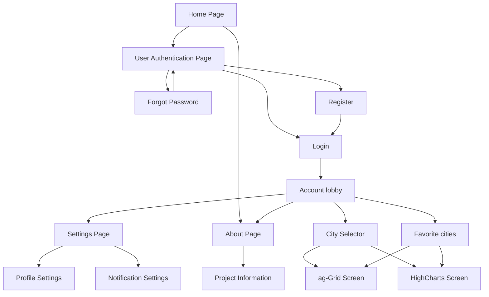
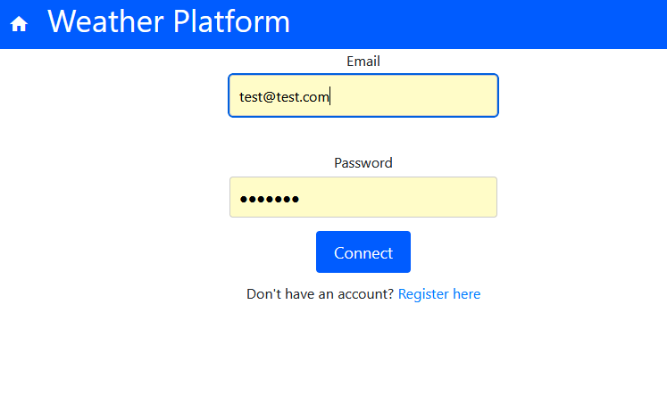
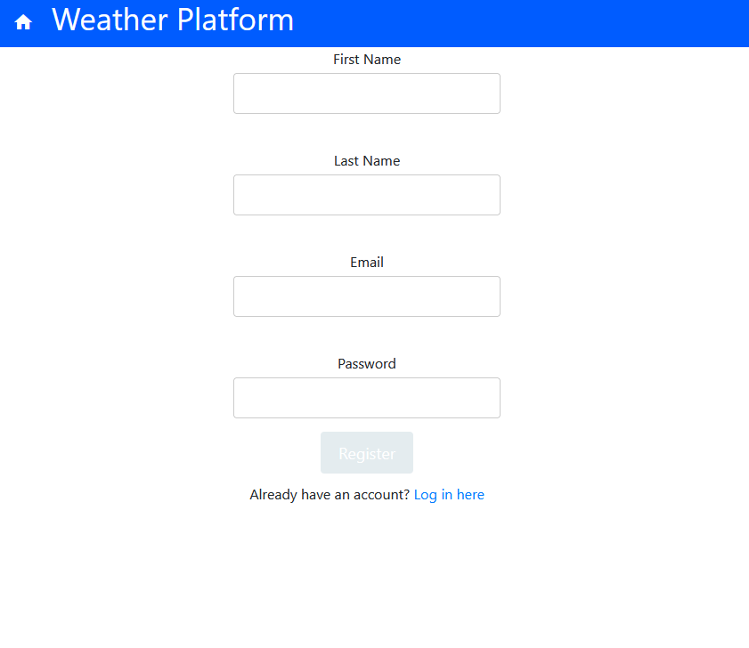

# Node and React Development Project

## GitHub link to the repository: 
https://github.com/MarcMonin/Node-Angular-Project/tree/main 

## Class:
CDOF1

## Team Members: 
Marc Monin - GitHub: MarcMonin

Noémie Mazepa - GitHub: Noemiemz

Ariste Mathiot - GitHub: ariste974

Lorrain Morlet - GitHub: Nasotro

## Project Summary:
A weather app to check the current weather and forecasts for any city.
The app provides real-time data on temperature, wind, humidity, and rain  but also charts to display the forecasts. 
It is also possible to save your favorite cities for a quicker access.

### Must include :
- Search for cities.
- Show weather details like temperature, wind, humidity, and rain.
- Weekly and daily forecasts with charts (Highcharts).
- Save favorite cities.

### Secondary needs : 
- User login to manage the user's favorite cities.
- About/Help page with some info about the app.
- Settings page.

## Pages scheme

## Description of each page

### Login
The login page allows already existing users to connect to their account by entering ther email and password. If they are not already registered in the database, they can access the Register page through the register button.
 

    

### Register
The registration page allows new users to create an account. To do this, they need to give their first and last name, their email and their password. 
Once they are registered, the new user can log in to have access to a new feature: being able to save their favorite cities. It also features a button to go back to the login page.
 

    

### Main weather page
This page is the central page of our app and users can search for specific cities, view their current weather details like the temparature, the wind speed, the humidity, etc. If the user is logged in, they are able to select cities as favorite so that they will be able to quickly access them in the favorites page.
 

    

### Forecast page
This page gives weather forecasts for a specific cities with Highcharts. The user can select up to 3 cities for which the weather will be predicted. Then, the user has access to 2 charts, the first one being the forecast for the next 24 hours and the second one being the forecast for the next 5 days
 

    
     
    

### Favorite page
This page lists all of the cities that were saved as favorite by the user so they can have a quck acces to them.
 

    

## User Guide
Open the app in your browser.

Create an account or log in to access personalized features like saving your favorite cities.

Use the search bar on the main page to find a city's weather details.

Explore the current conditions and forecasts for the selected city.

Click the "Add to Favorites" button to save cities for quick access later.

Navigate to the forecast page for detailed weekly and hourly weather trends.

Access your saved cities on the "Favorite" page to manage your list.

Enjoy using our weather app to stay informed about weather conditions in your favorite cities!

## Links used for Research and Help during this project:
High Charts: https://codepen.io/pen?&prefill_data_id=325529a3-52ee-4202-b6fc-997aceac62f7 https://www.highcharts.com/demo/highcharts/line-labels

Open Weather Map API: https://openweathermap.org/api https://openweathermap.org/current https://www.youtube.com/watch?v=14MDWUXYYEM&ab_channel=Elio-GeeZMoKeZ

Open Meteo API: https://open-meteo.com/en/docs/historical-weather-api

Open Weather Map API: https://openweathermap.org/api 
https://openweathermap.org/current
https://www.youtube.com/watch?v=14MDWUXYYEM&ab_channel=Elio-GeeZMoKeZ 

Open Meteo API: https://open-meteo.com/en/docs/historical-weather-api
