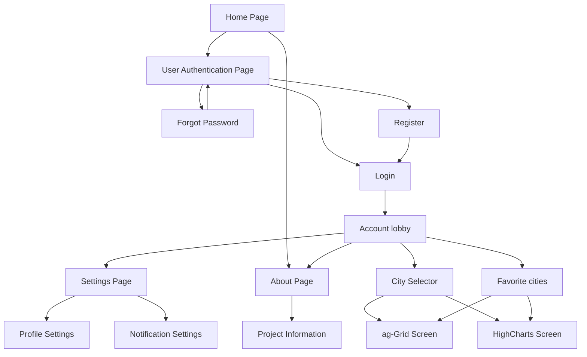

# Node and React Development Project

## GitHub link to the repository: 
https://github.com/MarcMonin/Node-Angular-Project/tree/main 

## Class:
CDOF1

## Team Members: 
Marc Monin

Noémie Mazepa

Ariste Mathiot

Lorrain Morlet

## Project Summary:
A weather app to check the current weather and forecasts for any city.
The app provides real-time data on temperature, wind, humidity, and rain  but also charts to display the forecasts. 
It is also possible to save your favorite cities for a quicker access.

### Must include :
- Search for cities.
- Show weather details like temperature, wind, humidity, and rain.
- Weekly and daily forecasts with charts (Highcharts).
- Save favorite cities.

### Secondary needs : 
- User login to manage the user's favorite cities.
- About/Help page with some info about the app.
- Settings page.

## Pages scheme

