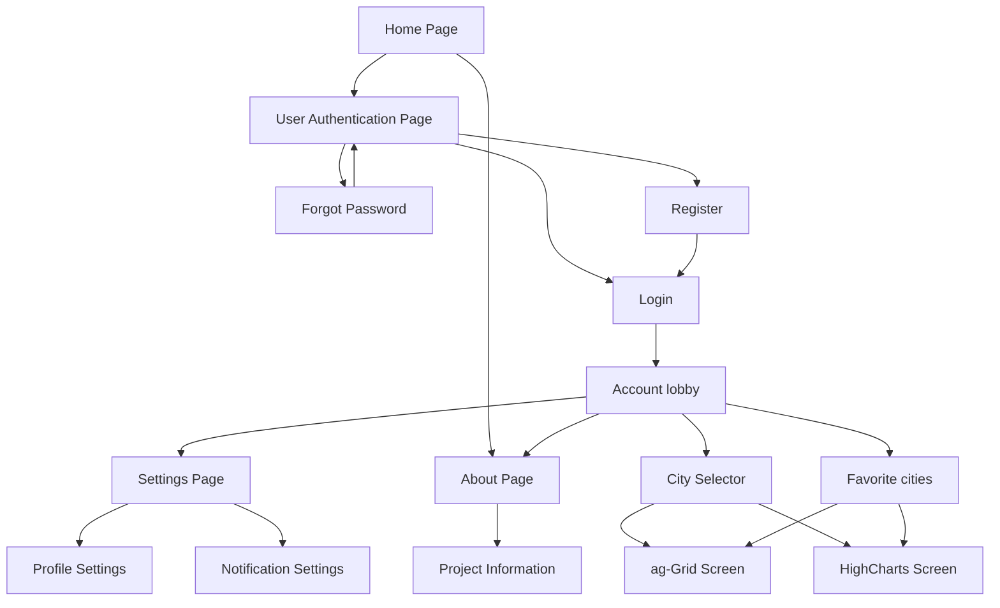

# Node and React Development Project

## GitHub link to the repository: 
https://github.com/MarcMonin/Node-Angular-Project/tree/main 

## Class:
CDOF1

## Team Members: 
Marc Monin - GitHub: MarcMonin

Noémie Mazepa - GitHub: Noemiemz

Ariste Mathiot - GitHub: ariste974

Lorrain Morlet - GitHub: Nasotro

## Project Summary:
A weather app to check the current weather and forecasts for any city.
The app provides real-time data on temperature, wind, humidity, and rain  but also charts to display the forecasts. 
It is also possible to save your favorite cities for a quicker access.

### Must include :
- Search for cities.
- Show weather details like temperature, wind, humidity, and rain.
- Weekly and daily forecasts with charts (Highcharts).
- Save favorite cities.

### Secondary needs : 
- User login to manage the user's favorite cities.
- About/Help page with some info about the app.
- Settings page.

## Pages scheme

## Description of each page

### Register
The registration page allows new users to create an account. To do this, they need to give their first and last name, their email and their password. 
Once they are registered, the new user can log in to have access to a new feature: being able to save their favorite cities.

### Login
The login page allows already existing users to connect to their account by entering ther email and password.

### Main weather page
This page is the central page of our app and users can search for specific cities, view their current weather details like the temparature, the wind speed, the humidity, etc. They can put cities as their favorite and they can also go to another page to see daily and weekly forecasts.

### Forecast page
This page gives weather forecasts for a specific city with Highcharts. They can select if they want the forecast to be for the current day only or for the next few days with an average temperature for each day on the chart.

### Favorite page
This page lists all of the cities that were saved as favorite by the user so they can have a quck acces to them.

### About page

## User Guide
