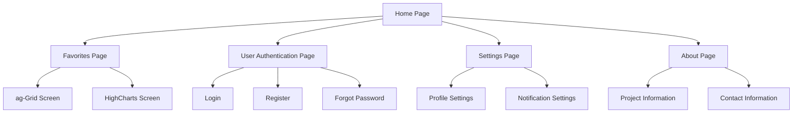

# Node-Angular-Project

# Team Members: 
Marc Monin

No?mie Mazepa

Ariste Mathiot

Lorrain Morlet

# SUJET

Weather forecast app that show the weather of a selected city
## must include :
- Hour per hour temperature in a graph (HighChart)
- Selection of the city
- rain probability

## Pages scheme

